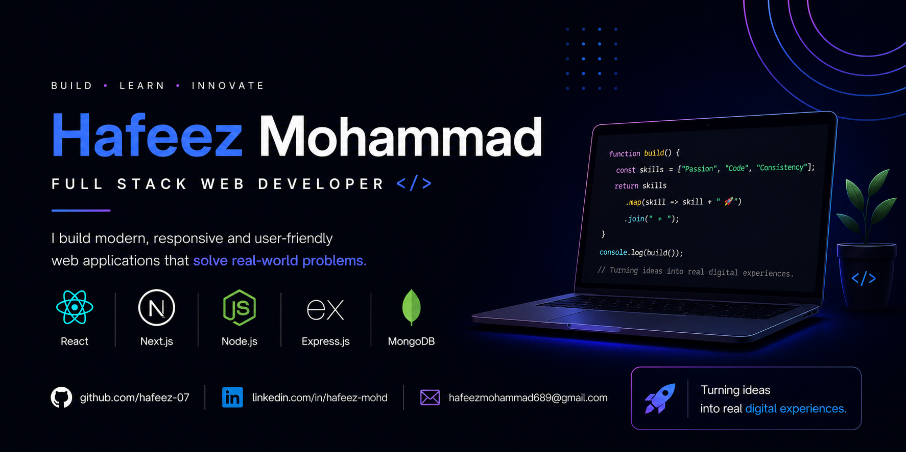

  

<h1 align="center">Hello 👋, I'm Hafeez Mohammad</h1>

<h3 align="center">A passionate Full Stack Developer in progress!</h3>

-  I'm from India, currently pursuing Engineering
- You can contact me at hafeezmohammad689@gmail.com
-  I enjoy building modern and responsive web applications
-  Currently working on improving my Full Stack Development skills through real projects
-  I'm open to collaborating on Web Development projects
-  Fun Fact — I love turning ideas into real applications

  ---

# 💻 Tech Stack:

---

# 🔭 Currently Working On

- Learning Next.js deeply
- Building Full Stack MERN Projects

---

# 🚀 Featured Projects

## 📝 VaultNote
A full-stack MERN notes application with authentication and modern responsive UI.

🔗 Live Demo: [View Project]((https://voicenote-alpha.vercel.app/))  📂 GitHub Repo: [Repository]((https://github.com/hafeez-07/voice-vault))

## ✍️ VaultVoice
A server-rendered blogging platform built using Node.js, Express, and EJS.

🔗 Live Demo: [View Project](https://voice-vault-sbrg.onrender.com/))  📂 GitHub Repo: [Repository](https://github.com/hafeez-07/voice-vault)

## 🔥 NoZeroDays App
A productivity-focused web application designed to help users stay consistent and track progress.

🔗 Live Demo: [View Project](https://react-no-zero-days-app.vercel.app/)  📂 GitHub Repo: [Repository](https://github.com/hafeez-07/react-no-zero-days-app)

## 🎬 MovieSearch App
A movie discovery application that fetches and displays movie data using external APIs.

🔗 Live Demo: [View Project]((https://react-movie-search-app-mu.vercel.app/))  📂 GitHub Repo: [Repository](https://github.com/hafeez-07/react-movie-search-app)

---

# 📊 GitHub Stats:

---

## 📈 Contribution Graph

---

# 📫 Connect With Me

  

  

  

---

<h3 align="center">⭐ Thanks for visiting my profile! ⭐</h3>

